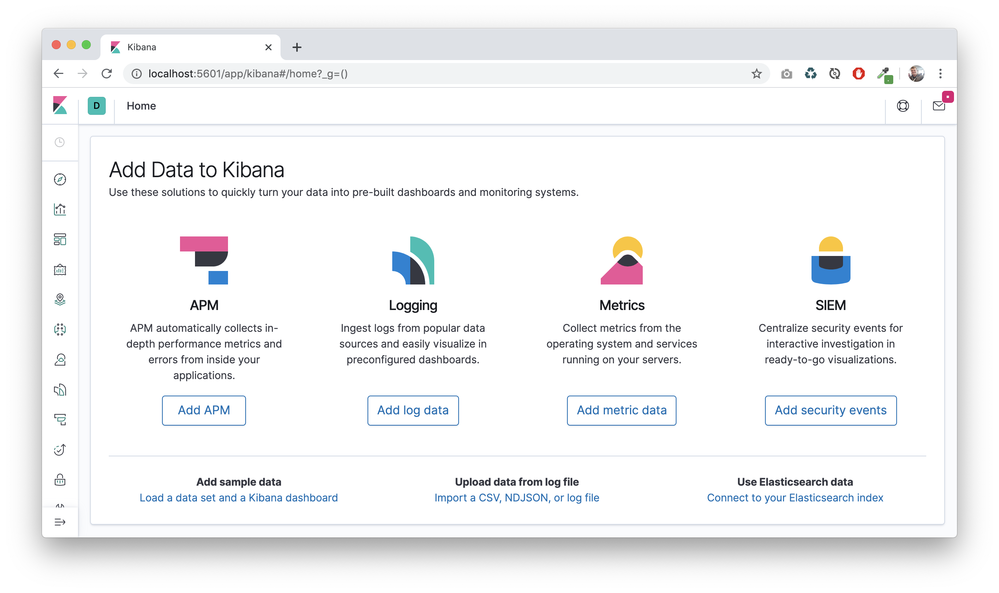
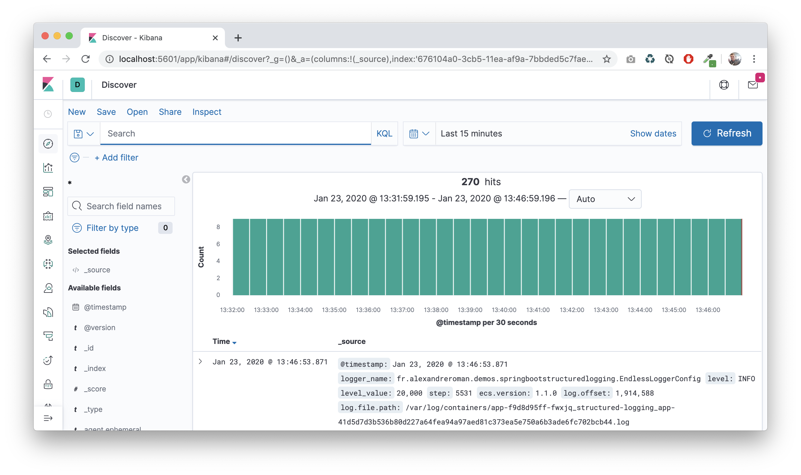
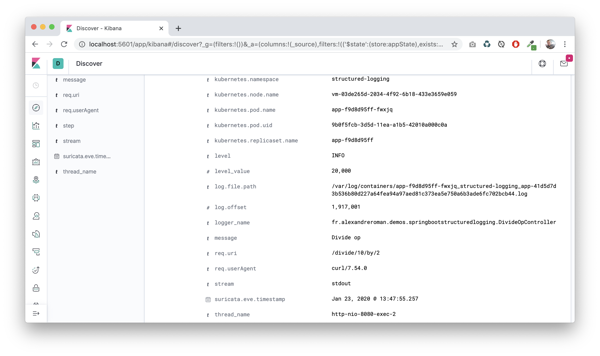
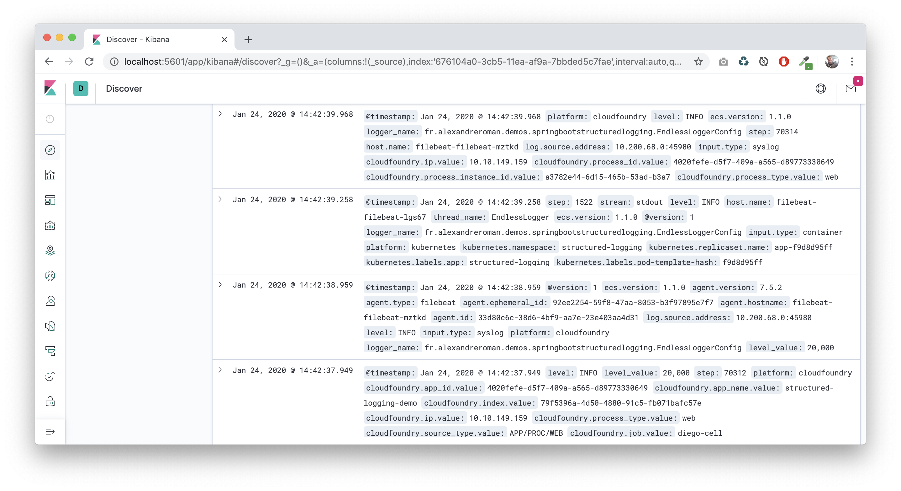
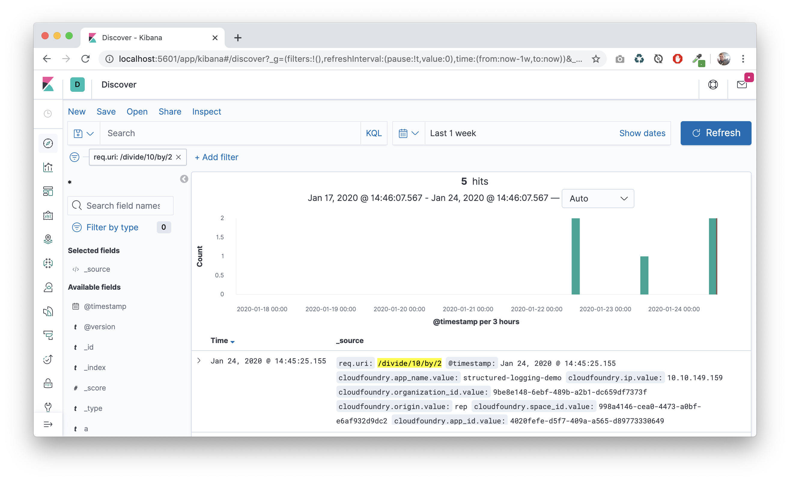

# Using structured logging with Spring Boot

This project shows how to set up structured logging with a Spring Boot app.
This way you can stream console output to Fluentd / Logstash / etc and index
your log entries.

## How to use it?

Compile this app using a JDK 11+:
```bash
$ ./mvnw clean package
```

Run this app:
```bash
$ java -jar target/spring-boot-structured-logging-demo.jar
...
{"@timestamp":"2019-11-26T15:04:52.184+01:00","@version":"1","message":"Logging step","logger_name":"fr.alexandreroman.demos.springbootstructuredlogging.EndlessLoggerConfig","thread_name":"main","level":"INFO","level_value":20000,"app":"spring-boot-structured-logging","step":"0"}
{"@timestamp":"2019-11-26T15:04:53.192+01:00","@version":"1","message":"Logging step","logger_name":"fr.alexandreroman.demos.springbootstructuredlogging.EndlessLoggerConfig","thread_name":"main","level":"INFO","level_value":20000,"app":"spring-boot-structured-logging","step":"1"}
```

## How do it work?

First, you need to include a Logback encoder in your project,
which is responsible for converting your log entries to JSON objects:
```xml
<dependency>
    <groupId>net.logstash.logback</groupId>
    <artifactId>logstash-logback-encoder</artifactId>
    <version>6.3</version>
</dependency>
```

Then, you can use this encoder in your Logback configuration:
```xml
<?xml version="1.0" encoding="UTF-8"?>
<configuration>
    <!-- Define a new appender with JSON output. -->
    <appender name="JSON_CONSOLE" class="ch.qos.logback.core.ConsoleAppender">
        <encoder class="net.logstash.logback.encoder.LogstashEncoder">
            <!-- This parameter allows you to add custom attributes
            as a Map argument (this must be the last argument). -->
            <enableContextMap>true</enableContextMap>
        </encoder>
    </appender>
    <root level="INFO">
        <appender-ref ref="JSON_CONSOLE"/>
    </root>
</configuration>
```

Use SLF4J in your Spring Boot app. The only difference is the use of a
`java.util.Map` object to hold log attributes:
```java
for (int i = 0; ; ++i) {
    // Add custom attributes to the log entry (as a Map argument).
    log.info("Logging step", Map.of("step", i));
}
```

This code will produce this log entry:
```syslog
{"@timestamp":"2019-11-26T15:04:52.184+01:00","@version":"1","message":"Logging step","logger_name":"fr.alexandreroman.demos.springbootstructuredlogging.EndlessLoggerConfig","thread_name":"main","level":"INFO","level_value":20000,"app":"spring-boot-structured-logging","step":"0"}
```

You may also use a Mapped Diagnostic Context (MDC) from SLF4J to hold attributes.
Don't forget to remove MDC attributes when you're done to prevent memory leaks
(you'd better use a try/finally block):
```java
MDC.put("user", "John Doe");
try {
    log.info("Processing request");
    processRequest();
} finally {
    MDC.remove("user");
}
```

In a web app, it's common to include "contextual" information for your log entries
(such as request path, user agent, etc.). Structured logging is a nice way to
"decorate" your logs with these informations.

Include this class in your Spring Boot project to automatically add request
context data in your logs:
```java
@Component
@Slf4j
class RequestLoggingFilter extends OncePerRequestFilter implements Ordered {
    @Override
    protected void doFilterInternal(HttpServletRequest request, HttpServletResponse response, FilterChain filterChain) throws ServletException, IOException {
        try {
            // Include request attributes.
            MDC.put("req.uri", request.getRequestURI());
            MDC.put("req.userAgent", request.getHeader("User-Agent"));
            MDC.put("req.xForwardedFor", request.getHeader("X-Forwarded-For"));
            filterChain.doFilter(request, response);
        } catch (Throwable ex) {
            // This request failed: write a log entry including stack trace as attribute.
            final StringWriter sw = new StringWriter(1024);
            ex.printStackTrace(new PrintWriter(sw, true));
            log.error("Request error", Map.of(
                    "error.message", ex.getMessage(),
                    "error.stacktrace", sw.getBuffer()));
            throw ex;
        } finally {
            // Remove attributes to prevent memory leaks.
            MDC.remove("req.uri");
            MDC.remove("req.userAgent");
            MDC.remove("req.xForwardedFor");
        }
    }

    @Override
    public int getOrder() {
        // Make sure this filter is executed first in the filter chain.
        return Ordered.HIGHEST_PRECEDENCE;
    }
}
```

## Deploying to Pivotal Platform

A single command is required to deploy this app to
[Pivotal Platform](https://pivotal.io/platform):
```bash
$ cf push
```

A random URL is assigned to the app by the platform:
```bash
$ cf apps
Getting apps in org myorg / space dev as johndoe@myorg.com...
OK

name                      requested state   instances   memory   disk   urls
structured-logging-demo   started           1/1         1G       1G     structured-logging-demo-surprised-baboon-hd.cfapps.io
```

Hit this URL to access the app:
```bash
$ curl structured-logging-demo-surprised-baboon-hd.cfapps.io
These endpoints are available:
 - http://structured-logging-demo-surprised-baboon-hd.cfapps.io/fault
 - http://structured-logging-demo-surprised-baboon-hd.cfapps.io/divide/10/by/2
```

## Deploying to Kubernetes

Build a Docker image using `pack` CLI from
[Cloud Native Buildpacks](https://buildpacks.io):
```bash
$ pack build myuser/spring-boot-structured-logging-demo --publish
```

Use the provided Kubernetes descriptors to deploy this app:
```bash
$ kubectl apply -f k8s
namespace/structured-logging unchanged
deployment.apps/app unchanged
```

Wait for the pod to be running:
```bash
$ kubectl -n structured-logging get pods
NAME                   READY   STATUS    RESTARTS   AGE
app-64d4cfd9df-7g9nv   1/1     Running   0          2m
```

Then you should be able to get logs from the running pod:
```bash
$ kubectl -n structured-logging logs -l app=structured-logging -f
{"@timestamp":"2019-11-26T21:34:22.765Z","@version":"1","message":"Logging step","logger_name":"fr.alexandreroman.demos.springbootstructuredlogging.EndlessLoggerConfig","thread_name":"main","level":"INFO","level_value":20000,"app":"spring-boot-structured-logging","step":"3934"}
{"@timestamp":"2019-11-26T21:34:23.765Z","@version":"1","message":"Logging step","logger_name":"fr.alexandreroman.demos.springbootstructuredlogging.EndlessLoggerConfig","thread_name":"main","level":"INFO","level_value":20000,"app":"spring-boot-structured-logging","step":"3935"}
```

## Using Elastic Search + Filebeat + Kibana to monitor logs

Using an EFK stack you'll be able to query app logs, all entries
are indexed by the platform.

In this example, we'll see how to deploy Elastic Search, Filebeat and Kibana to a
[VMware PKS](https://cloud.vmware.com/vmware-enterprise-pks)
managed Kubernetes cluster.

Create namespace `efk`:
```bash
$ kubectl create ns efk
```

Add Helm repositories:
```bash
$ helm repo add elastic https://helm.elastic.co
$ helm repo add stable https://kubernetes-charts.storage.googleapis.com
$ helm repo update
```

Deploy Elastic Search:
```bash
$ helm upgrade -f k8s/elasticsearch/values.yml -n efk -i --version 7.5.1 elasticsearch elastic/elasticsearch
```

Deploy Filebeat (PKS only):
```bash
$ helm upgrade -f k8s/filebeat/values-pks.yml -n efk -i --version 7.5.2 filebeat elastic/filebeat
```

The Filebeat configuration only includes logs from pods in Kubernetes namespace `structured-logging`:
```yaml
filebeatConfig:
  filebeat.yml: |
    filebeat.autodiscover:
      providers:
        - type: kubernetes
          templates:
            - condition:
                equals:
                  kubernetes.namespace: structured-logging
              config:
                - type: container
                  fields:
                    platform: kubernetes
                  fields_under_root: true
                  paths:
                    - /var/log/containers/*-${data.kubernetes.container.id}.log
                  json.keys_under_root: true
                  json.message_key: message
```

There is also a syslog endpoint you may want to use to drain logs from Pivotal Platform.

Expose a syslog endpoint (from Filebeat) to receive logs from Pivotal Platform:
```bash
$ kubectl apply -f k8s/filebeat/syslog-service.yml
```

The syslog endpoint is exposed using a `LoadBalancer` object, on port 9000:
```bash
$ kubectl -n efk get svc filebeat-syslog
NAME              TYPE           CLUSTER-IP       EXTERNAL-IP   PORT(S)          AGE
filebeat-syslog   LoadBalancer   10.100.200.139   34.77.79.3    9000:31491/TCP   20h
```

In case you want to forward logs from Pivotal Platform to the EFK stack, you need
to drain logs from the app:
```bash
$ cf cups filebeat-syslog -l syslog://34.77.79.3:9000
```

Bind this syslog endpoint to the app:
```bash
$ cf bind-service structured-logging-demo filebeat-syslog
```

Then, you only need to restage the app to start receiving logs in the syslog endpoint:
```bash
$ cf restage structured-logging-demo
```

You're almost done!

Deploy Kibana:
```bash
$ helm upgrade -f k8s/kibana/values.yml -n efk -i --version 7.5.2 kibana elastic/kibana
```

At this point, logs are sent to Filebeat
(no matter which platform you use: Pivotal Platform and/or Kubernetes),
then logs are indexed by Elastic Search.
Use Kibana to view logs.

Open a connection to the Kibana service:
```bash
$ kubectl -n efk port-forward deployment/kibana-kibana 5601
```

Hit http://localhost:5601 to access the Kibana dashboard.



Configure Kibana to index logs received from Elastic Search.



As you click on a log entry, you'll see log attributes:



If you set up the syslog endpoint, then you can monitor logs from apps running
in Pivotal Platform and Kubernetes in the same Kibana instance:



Use filters to select a subset of logs
(for example: request URI, user agents, platform, etc.):



## Contribute

Contributions are always welcome!

Feel free to open issues & send PR.

## License

Copyright &copy; 2020 [VMware, Inc](https://vmware.com).

This project is licensed under the [Apache Software License version 2.0](https://www.apache.org/licenses/LICENSE-2.0).
